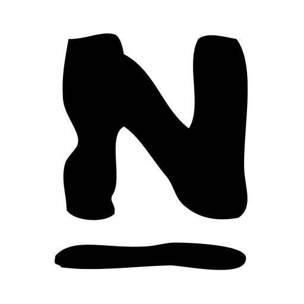

# 👋 Hi there, my name is Donát.
### ☁️ Cloud && DevOps Engineer
 
 
 - 🔭 I’m motivated by continuous learning and exciting challenges.
 - ☁️ Currently I'm preparing for my next AWS certification (Developer Associate).
 - 🟢🦊🎓 I’m a Green Fox Academy alumni: graduated as DevOps Engineer / Full Stack Developer.

<h4 align="left">Certifications:</h4>

 

 

<h4 align="left">Languages and Tools:</h4>

 
 
 
  

  
  

  
  
<h5 align="left">DevOps:</h5>

 
 
 

 
 
 
<h5 align="left">Frontend:</h5>

 
  
 
 

 

 
 
 

<h5 align="left">Backend:</h5>

 

 
 
  <h4 align="left">Contact:</h4>

  

