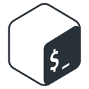

# 👋 Hi there, my name is Donát.
### I am an aspiring Full Stack Developer / DevOps Engineer.
 
 
 - 🔭 I’m currently working on broadening and deepening my knowledge in coding.
 - 🌱 I’m currently learning full stack web development at Green Fox Academy🟢🦊🎓.
 - 📚 I'm currently reading Clean Code by Robert C. Martin.
 -  👨‍💻 In my free time I'm learning Android development.
 - 🎸 I also enjoy playing my guitar and playing football ⚽.
 
<h4 align="left">Languages and Tools:</h4>

 
 
 
 
  

  
  

 
<h5 align="left">Frontend:</h5>

 
  
 
 

 

 
 
 

<h5 align="left">Backend:</h5>

 

 
 
 
<h5 align="left">DevOps:</h5>

 
 

  <h4 align="left">Side projects:</h4>

   
  
  

  

   
  

  <h4 align="left">Contact:</h4>

  

<!--
Here are some ideas to get you started:

- 👯 I’m looking to collaborate on ...
- 🤔 I’m looking for help with ...
- 💬 Ask me about ...
- 📫 How to reach me: ...
- 😄 Pronouns: ...
- ⚡ Fun fact: ...
-->
